## 🌍 Versions multilingues du README

| 🇫🇷 Français | 🇬🇧 English | 🇪🇸 Español |
|-------------|------------|------------|
| Vous êtes ici ! | [README.md](./README.md) | [README.es.md](./README.es.md) |

----

# Détection d’anomalies en temps réel dans un flux vidéo

## 📌 Contexte  

J’ai réalisé une **thèse CIFRE** (Convention Industrielle de Formation par la Recherche) d’une durée de **3 ans** (du 4 décembre 2019 au 4 décembre 2022), intitulée **_Détection d’anomalies en temps réel dans un flux vidéo_**.  

Durant cette période, j’ai occupé le poste de **chercheur** au sein de la startup [**Othello** 🚀](http://www.othello.group), ce qui m’a permis de mener mes travaux de recherche directement en entreprise tout en étant encadré par le **Laboratoire d’Intelligence Artificielle et Sémantique des Données (LIASD)** 🧠 de l’Université **Paris 8** 📚, favorisant ainsi le transfert de connaissances entre le monde industriel et la recherche 🤝.

---

## 🎯 Objectif  

L’objectif de ce projet était de développer une solution de **détection d’anomalies par intelligence artificielle** 🤖, dans le cadre de l’appel à projet visant à **assurer la sécurité des Jeux Olympiques de Paris 2024** 🏅.
Parmi les contraintes imposées :  
- Le modèle devait fonctionner **en temps réel** afin de permettre une intervention rapide et ainsi garantir la sécurité et la sûreté des personnes impliquées.
  
- Les ressources disponibles étaient limitées : **pas d’accès à un serveur GPU** ni à de **véritables caméras de surveillance**, ce qui a renforcé le défi technique du projet.
  
- Le modèle devait être **léger et optimisé**, de sorte à pouvoir fonctionner sans nécessiter un serveur GPU puissant, ce qui était essentiel compte tenu des ressources limitées.  

---

## 💡 Postulat  

En tant qu’humains, nous pouvons facilement identifier une situation anormale dans une scène ou une vidéo :  
- un **incendie** grâce à la présence de fumée ou de flammes 🔥  
- une **bagarre** en observant les interactions entre plusieurs personnes 👥  
- un **accident de la route** en surveillant les véhicules 🚗  
- un **danger** potentiel en repérant une arme blanche ou à feu 🗡️🔫  
- De plus, un accident de la route **ne peut pas se produire** si aucun véhicule n’est visible à l’écran.

Ces observations m'ont inspirés à combiner dans ce projet :  
1. **Analyse spatiale** : détection d’objets et de poses humaines potentiellement suspectes   
2. **Analyse temporelle** : suivi des actions des objets et des individus dans le temps    

L’objectif est de créer une architecture combinant **analyse spatiale et temporelle**, reproduisant, de manière simplifiée, la façon dont les humains interprètent une scène en observant les objets et leur dynamique pour comprendre la situation dans son ensemble dans le but d’évaluer si cette approche peut surpasser les méthodes classiques.

---

## ⚙️ Environnement technique  

L'esmble du projet a été développé sur un ordinateur portable fourni par l’entreprise, équipé des composants suivants :  
- **Mémoire RAM :** 32 Go  
- **Processeur :** Intel Core i9, 16 cœurs cadencés à 2,3 GHz  
- **Carte graphique :** Nvidia GeForce RTX 2080 avec 8 Go de RAM dédiée  

Côté logiciel, le développement et l’entraînement des modèles ont été réalisés avec :  
- **Python**  
- **Keras** pour la conception et l’entraînement des modèles d’intelligence artificielle

---

## 📊 Jeu de données  

### 1️⃣ Vidéos pour la détection d’anomalies 

Aucun jeu de données public n’était suffisamment adapté pour entraîner efficacement notre modèle :  
- Manque de volume et de variété  
- Qualité insuffisante  
- Présence d’anomalies ne représentant pas de conséquences directes sur la sécurité et la sûreté des personnes impliquées  

Nous avons donc conçu notre propre jeu de données.

⚠️ *Ce jeu de données est propriétaire et ne peut être ni partagé ni diffusé.* ⚠️

#### 🏷️ Classes et répartition

Le jeu de données est composé de **4 classes** :  
- **Fight** (bagarre)  
- **Shooting** (coup de feu)  
- **Fire** (incendie)  
- **Normal** (aucun problème détecté)  

Il est **déséquilibré**, car certaines anomalies sont plus rares que d’autres. Sa répartition est la suivante :  

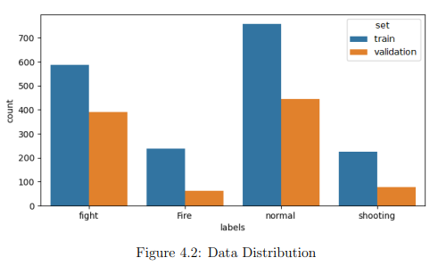  

| Classe  | Train Videos (nb) | Train Duration | Validation Videos (nb) | Validation Duration |
|---------|-----------------|----------------|-----------------------|------------------------|
| Fight   | 587             | 0h50           | 391                   | 0h31                   |
| Fire    | 237             | 3h40           | 61                    | 0h46                   |
| Shooting| 247             | 0h17           | 64                    | 0h08                   |

#### 🖼️ Pré-traitement et augmentation  

- Chaque vidéo contenant une anomalie a été **découpée manuellement** pour ne conserver que la portion pertinente.  
- Les vidéos ont été chargées via un **video generator** (voir [repo GitHub](lien_vers_repo)) pour former des **séquences de 20 images de taille 112x122**.  
- Une **data augmentation réaliste** a été appliquée pour simuler des situations plausibles :  
  - Modification de la **luminosité**  
  - **Flip horizontal**  
  - **Zoom**  

### 2️⃣ Images pour la détection d’objets  

Conformément au postulat de **combiner détection d’objets et détection d’anomalies**, nous avons créé un **second jeu de données basé sur des images**, ciblant les entités présentes à l’écran et liées aux anomalies.  

#### 🏷️ Classes et volume

Les classes et volumes approximatifs sont les suivants :  
- **Armes à feu** : ~10 000 images 🔫  
- **Flammes** : >2 000 images 🔥  
- **Personnes** : chaque individu présent dans les images 👤  

Des images **ne contenant aucune de ces classes** ont également été ajoutées, pour l’apprentissage et la validation, afin de mieux gérer les situations normales.  

#### 🖼️ Annotation et utilisation

- Les images ont été **étiquetées manuellement**.

---

## 🧠 Modèle

Le système de détection combine plusieurs architectures pour traiter les flux vidéo à la fois sur le **plan spatial** et le **plan temporel** :  

- **CNN + RNN** : utilisé pour l’**analyse temporelle** des séquences vidéo.  
- **YOLOv3, YOLOv4, YOLOv7** : utilisés pour l’**analyse spatiale** des images.  

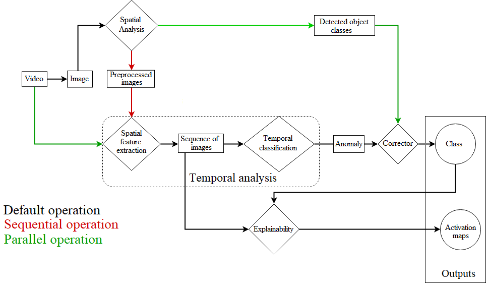  
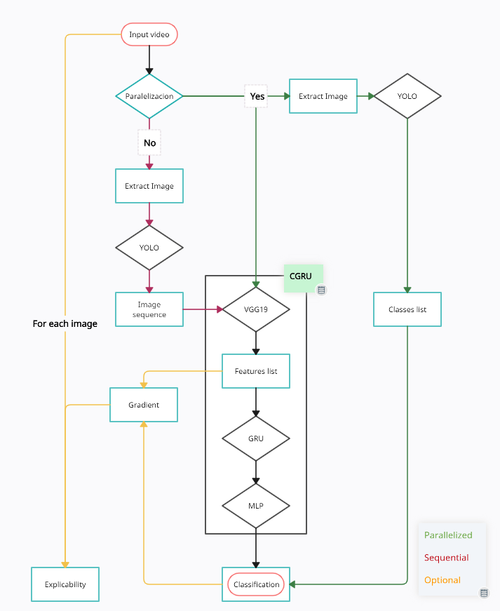  

### 🔄 Combinaison des modèles

Les modèles peuvent être combinés de différentes manières :  
1. **Série** : YOLO est utilisé pour un **pré-traitement spatial**, et ses résultats sont ensuite transmis au CNN+RNN pour l’analyse temporelle.
   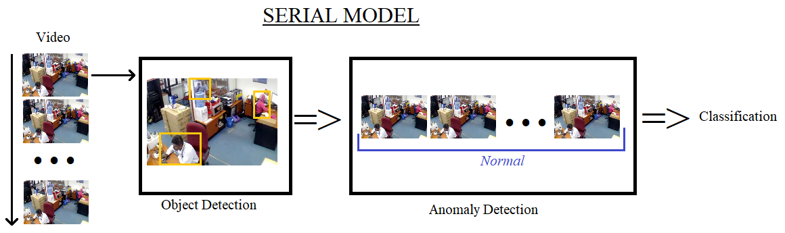
   
2. **Parallèle** : les deux modèles effectuent simultanément leur détection, puis leurs résultats sont **fusionnés** pour produire la prédiction finale.  
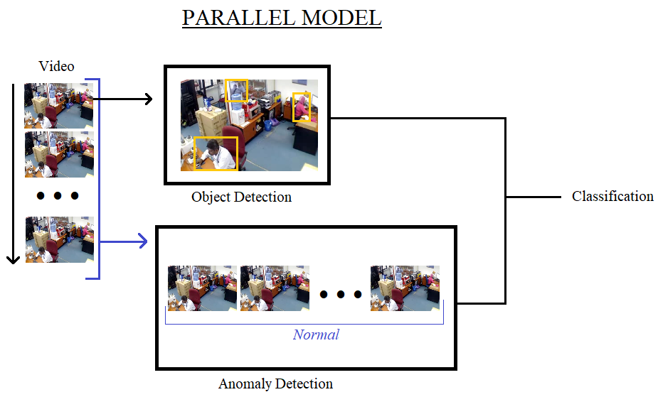

Un **module d’explicabilité** est également intégré pour analyser certaines prédictions, bien qu’il **ne fonctionne pas en temps réel**.  

### 🖥 CNN + RNN
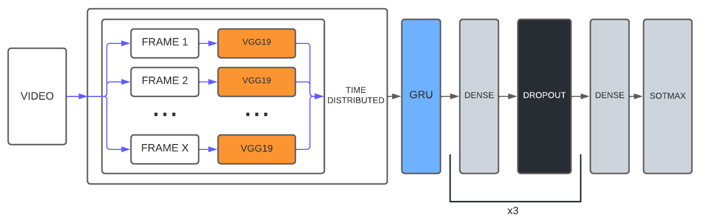  

- **CNN** : VGG19  
- **RNN** : GRU avec **1024 neurones**,
- suivi d’un **MLP à 3 couches** (1024 → 512 → 128 neurones)  
  - **Dropout :** 50% sur toutes les couches  
  - **Régularisation L2 :** coefficient 0.01  
- **Entraînement** :  
  - Batch training sur nos vidéos  
  - **200 epochs**  
  - Optimiseur : **Stochastic Gradient Descent (SGD)** avec **learning rate 0.01**

### 🖼 YOLO

Les modèles **YOLOv3, YOLOv4 et YOLOv7** ont été **re-entraînés sur notre jeu de données d’images**, permettant une détection adaptée aux classes définies dans notre dataset.

---

## 📈 Résultats

### 🖼️ 1. Détection d’objets

Les résultats suivants montrent la détection des objets clés sur des images extraites de nos vidéos.
Ces résultats illustrent la capacité de notre modèle YOLO à localiser précisément les entités importantes pour la sécurité.

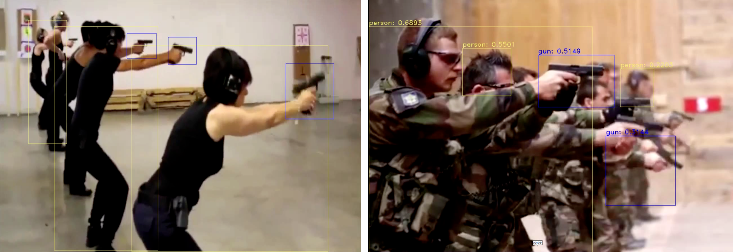
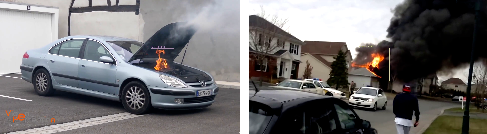

---

### 🎬 2. Analyse vidéo

Pour illustrer les performances de notre approche, nous présentons ci-dessous plusieurs exemples d’analyses vidéo.  
Chaque séquence combine la **détection spatiale** (personnes, objets, flammes, etc.) avec une **analyse temporelle** basée sur VGG-GRU, permettant de mettre en évidence les anomalies en temps réel.  

📸 **captures d’écran**  
- Détection d’un départ de feu.  
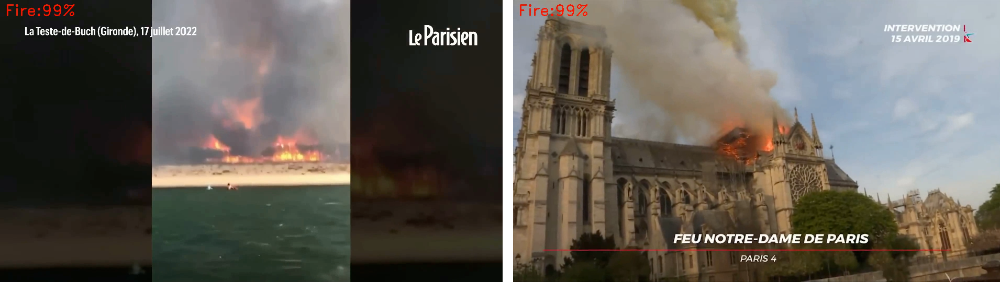  

- Détection d’un accident de la route.  
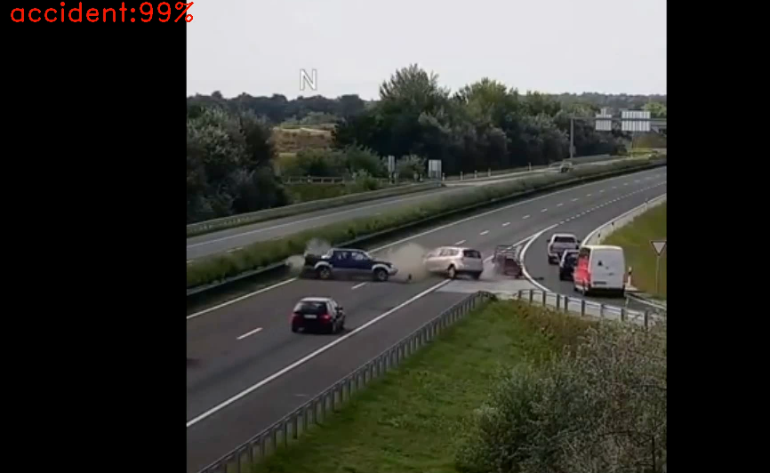  

🎥 **Exemples vidéos**  
- [▶️ Détection d’incendie à Notre-Dame (voir la vidéo)](https://youtu.be/Zg4AAycii1M)  
- [▶️ Détection d'une bagarre lors d'un match de rugby (voir la vidéo)](https://youtu.be/vdMqYTSrXok) 

---

### 🏆 3. Prix de la meilleure démonstration

Vidéo illustrant nos premier résultat ayant reçu le **prix de la meilleure démonstration à EGC 2022**.  

▶️ [Voir la vidéo de démonstration](https://www.youtube.com/watch?v=EGHUEPMI4c8)

---

### 🧐 Explicabilité du modèle  

Afin de mieux comprendre le fonctionnement interne de notre système, nous avons intégré un **module d’explicabilité**.  
Celui-ci joue un double rôle :  
- **Analyser les prédictions** du modèle pour en identifier les raisons.  
- **Aider au réglage des hyperparamètres** en mettant en évidence les zones ou caractéristiques les plus influentes.  

---

#### 🔍 Visualisation des prédictions  
Ces exemples illustrent la manière dont l’explicabilité met en évidence les régions pertinentes pour la détection d’anomalies :  

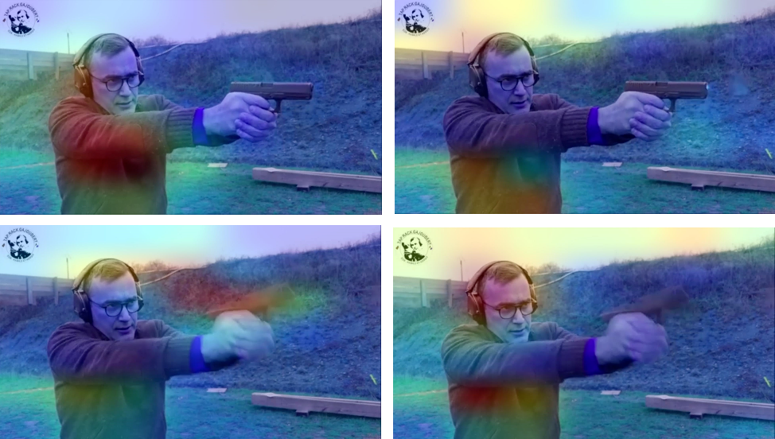  
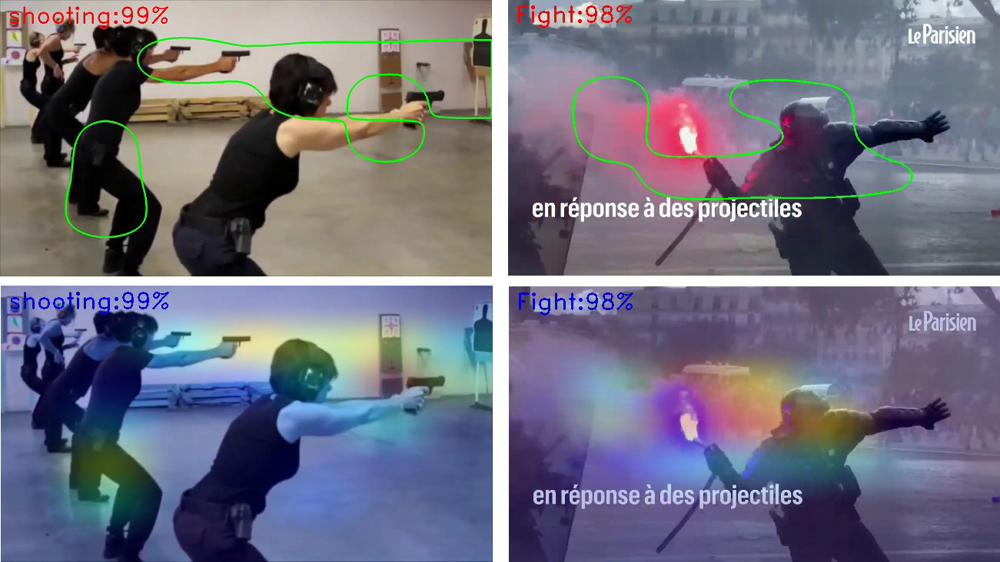  

---

#### ⚙️ Aide à la configuration du modèle  
L’explicabilité a également été utilisée pour analyser les comportements des différentes couches (GRU et MLP), permettant d’affiner la conception de l’architecture et son paramétrage.  

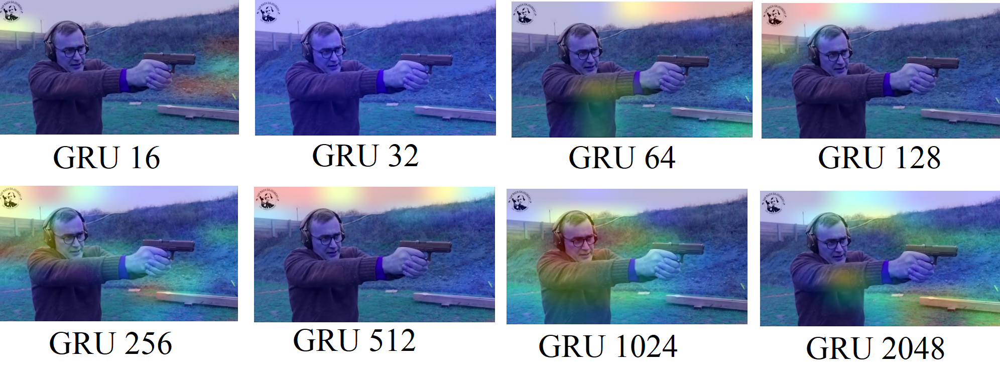  
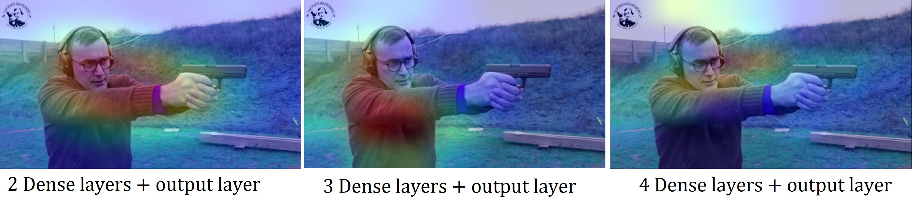  

---

### 📊 5. Statistiques et performances  

Pour évaluer notre approche, nous avons testé différentes **architectures de combinaison** entre YOLO (pour l’analyse spatiale) et VGG-GRU (pour l’analyse temporelle).  
Deux configurations principales ont été comparées :  

1. **Mode série** : les sorties de YOLO servent directement d’entrée au VGG-GRU.  
2. **Mode parallèle** : YOLO et VGG-GRU réalisent leurs prédictions séparément, puis leurs résultats sont combinés pour produire la décision finale.  

Les tableaux suivants présentent les performances obtenues pour ces deux configurations, en termes de **précision, rappel, F1-score et matrice de confusion**.

#### Performance de YOLO + VGG-GRU disposé en série

| Metric     | Accuracy | Précision | Rappel  | F1-Score |
|------------|----------|-----------|---------|----------|
| Valeur     | 87.3%    | 87.6%     | 87.3%   | 87.1%    |

#### Matrice de confusion en pourcentage pour une évaluation en série

| Truth \ Predicted | Bagarre | Coup de feu | Incendie | Normal |
|-------------------|---------|-------------|----------|--------|
| **Bagarre**       | 60.5%   | 2.4%        | 1.3%     | 35.8%  |
| **Coup de feu**   | 10%     | 55.6%       | 14.8%    | 19.6%  |
| **Incendie**      | 15.5%   | 10.6%       | 48%      | 25.9%  |
| **Normal**        | 3.4%    | 0.6%        | 1%       | 95%    |

#### Performance de YOLO + VGG-GRU disposé en parallèle

| Metric     | Accuracy | Précision | Rappel  | F1-Score |
|------------|----------|-----------|---------|----------|
| Valeur     | 78.42%   | 85.60%    | 78.42%  | 81.16%   |

####  Matrice de confusion en pourcentage pour une évaluation en parallèle

| Truth \ Predicted | Bagarre | Coup de feu | Incendie | Normal |
|-------------------|---------|-------------|----------|--------|
| **Bagarre**       | 63.66%  | 6.58%       | 1.93%    | 27.83% |
| **Coup de feu**   | 9.94%   | 66.06%      | 9.33%    | 14.67% |
| **Incendie**      | 13.66%  | 15.73%      | 57.71%   | 12.9%  |
| **Normal**        | 7.43%   | 5.96%       | 3.98%    | 82.63% |

Enfin, nous avons évalué les deux approches (parallèle et série) du point de vue **temps d’exécution** afin de vérifier leur applicabilité en conditions réelles.  
Les résultats montrent que :  
- le **mode parallèle** permet un traitement plus rapide, avec un temps moyen proche du temps réel pour certaines vidéos,  
- le **mode série**, bien que plus précis, entraîne un coût temporel nettement plus élevé.  

Les tableaux ci-dessous résument ces mesures pour différentes vidéos d’évaluation.  

#### Temps d’exécution de YOLO + VGG-GRU en parallèle

| Durée de la vidéo | FPS de la vidéo | Moyenne de détections | Temps de traitement |
|-------------------|-----------------|-----------------------|---------------------|
| 16s               | 33              | 601ms                 | 15s                 |
| 44s               | 30              | 533ms                 | 35s                 |
| 9s                | 30              | 994ms                 | 12s                 |
| 35s               | 30              | 1.1s                  | 57s                 |
| 23s               | 30              | 1s06                  | 35s                 |
| 1min 43           | 30              | 758ms                 | 116s (1min 56)      |
| 50s               | 30              | 826ms                 | 61s                 |
| 1min 05           | 30              | 886ms                 | 83s (1min 23)       |
| 2s                | 30              | 847ms                 | 847ms               |
| 9s                | 30              | 870ms                 | 11s                 |
| 2s                | 30              | 1s                    | 1s                  |

#### Temps d’exécution de YOLO + VGG-GRU en série

| Durée de la vidéo | FPS de la vidéo | Moyenne de détections | Temps de traitement |
|-------------------|-----------------|-----------------------|---------------------|
| 16s               | 33              | 1s                    | 26s                 |
| 44s               | 30              | 1s                    | 71s (1min 11)       |
| 9s                | 30              | 1.5s                  | 20s                 |
| 35s               | 30              | 1.5s                  | 81s (1min 21)       |
| 23s               | 30              | 1.5s                  | 48s                 |
| 1min 43           | 30              | 1.2s                  | 193s (3min 13)      |
| 50s               | 30              | 1.3s                  | 102s (1min 42)      |
| 1min 05           | 30              | 1.4s                  | 134s (2min 14)      |
| 2s                | 30              | 1.3s                  | 1.3s                |
| 9s                | 30              | 1.3s                  | 17s                 |
| 2s                | 30              | 1.5s                  | 1.5s                |

---

## ⚠️ Limitations & Confidentialité

- **Nombre limité de classes** : seules quelques classes ont été traitées, car la collecte et la labellisation des données sont longues et coûteuses.
  
- **Pas de comparaison avec d’autres architectures** : le projet ne permet pas de benchmark direct avec des solutions existantes.
  
- **Technologies non utilisées** : les auto-encodeurs ou Vision Transformers n’ont pas été explorés, faute de temps et de puissance, de plus ces architectures ne sont pas toujours adaptées au traitement en **temps réel**.

L’ensemble des jeux de données utilisés ainsi que le code développé dans le cadre de cette thèse sont la **propriété exclusive de l’entreprise Othello**.  
Pour des raisons de confidentialité et de protection de la propriété intellectuelle, ils ne peuvent donc pas être partagés publiquement.  

---

## 📚 Publications / Articles

### 🎓 Thèses

- 🇫🇷 **Détection d’anomalies en temps réel dans un flux vidéo** (2023)  
  Auteur : F. Poirier  
  [Lien HAL](https://hal.science/tel-04792952)  

- 🇬🇧 **Real-Time Anomaly Detection in Video Streams** (2023)  
  Auteur : F. Poirier  
  Thèse traduite  
  [Lien HAL](https://hal.science/tel-04824941)
  [Lien ArXiv](https://arxiv.org/abs/2411.19731)  

### 📝 Articles scientifiques

- 🇬🇧 **From CNN to CNN RNN Adapting Visualization Techniques for Time-Series Anomaly Detection** (2025, soumis)  
  Auteurs : F. Poirier, M. Lamolle  
  En cours de soumission au journal *Engineering Applications of Artificial Intelligence*
  
- 🇬🇧 **From CNN to CNN+ RNN: Adapting Visualization Techniques for Time-Series Anomaly Detection** (2024)  
  Auteur : F. Poirier  
  [Lien ArXiv](https://arxiv.org/abs/2411.04707)  

- 🇬🇧 **Real-Time Anomalies Detection on Video** (2024)  
  Auteur : F. Poirier  
  [Lien ArXiv](https://arxiv.org/abs/2410.18051)  

- 🇬🇧 **Hybrid Architecture for Real-Time Video Anomaly Detection: Integrating Spatial and Temporal Analysis** (2024)  
  Auteur : F. Poirier  
  [Lien ArXiv](https://arxiv.org/abs/2410.15909)  

- 🇬🇧 **Enhancing Anomaly Detection in Videos using a Combined YOLO and a VGG GRU Approach** (2023)  
  Auteurs : F. Poirier, R. Jaziri, C. Srour, G. Bernard  
  Conférence : 20th ACS/IEEE International Conference on Computer Systems and Applications (AICCSA)  
  [Lien IEEE](https://ieeexplore.ieee.org/abstract/document/10479307)  

- 🇫🇷 **Détection d’anomalies en temps réel dans le flux vidéo** (2022)  
  Auteurs : F. Poirier, R. Jaziri, C. Srour, G. Bernard  
  [Lien HAL](https://hal.science/hal-04810781)  

### 🏆 Posters et distinctions

- 🇫🇷 **Détection d’anomalies en temps réel dans le flux vidéo**  
  Poirier Fabien, R. Jaziri, C. Srour, G. Bernard  
  Poster présenté à EGC 2022  
  [Lien HAL](https://hal.science/hal-04830165v1/document)  
  🏅 **Prix de la Meilleure Démonstration** EGC 2022
