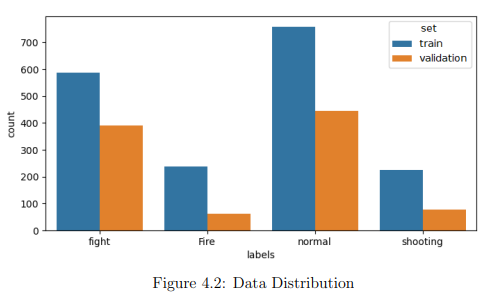
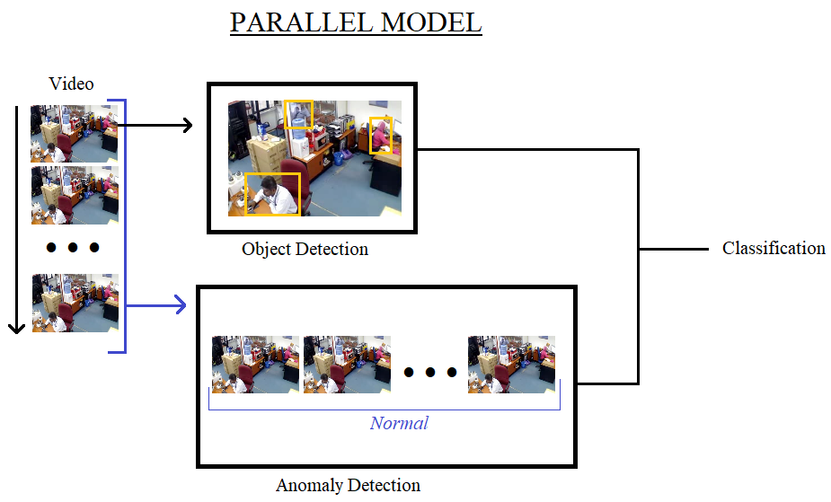
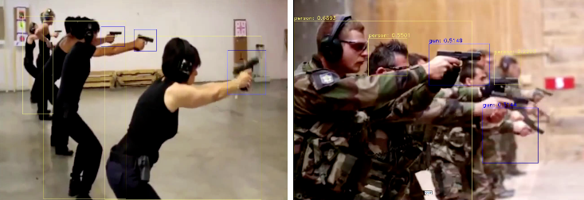
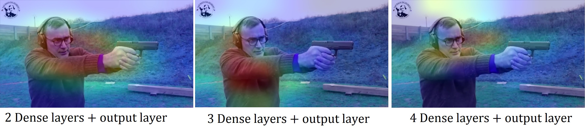

# Real-Time Anomaly Detection in Video Streams

## 📌 Context  

I completed a **CIFRE PhD** (Industrial Research Training Agreement) over a period of **3 years** (from December 4, 2019, to December 4, 2022), titled **_Real-Time Anomaly Detection in Video Streams_**.  

During this time, I held the position of **researcher** at the startup [**Othello** 🚀](http://www.othello.group), which allowed me to conduct my research directly within the company while being supervised by the **Laboratory of Artificial Intelligence and Semantic Data (LIASD)** 🧠 at **Paris 8 University** 📚, thus promoting knowledge transfer between industry and academia 🤝.

---

## 🎯 Objective  

The goal of this project was to develop an **AI-based anomaly detection solution** 🤖, within the scope of the call for projects aimed at **ensuring the security of the Paris 2024 Olympic Games** 🏅.  

The imposed constraints included:  
- The model had to operate in **real-time** to allow rapid intervention and ensure the safety and security of all individuals involved.  

- Available resources were limited: **no access to a GPU server** and **no real surveillance cameras**, which added a significant technical challenge to the project.  

- The model needed to be **lightweight and optimized**, allowing it to run without requiring a powerful GPU server, which was critical given the limited resources.  

---

## 💡 Hypothesis  

As humans, we can easily identify an abnormal situation in a scene or a video:  
- a **fire** by the presence of smoke or flames 🔥  
- a **fight** by observing the interactions between several people 👥  
- a **traffic accident** by monitoring vehicles 🚗  
- a **potential danger** by spotting a knife or a firearm 🗡️🔫  
- Moreover, a traffic accident **cannot occur** if no vehicles are visible on the screen.

These observations inspired me to combine in this project:  
1. **Spatial analysis**: detection of objects and potentially suspicious human poses  
2. **Temporal analysis**: tracking the actions of objects and individuals over time  

The goal is to create an architecture combining **spatial and temporal analysis**, reproducing, in a simplified way, how humans interpret a scene by observing objects and their dynamics to understand the situation as a whole, in order to evaluate whether this approach can outperform classical methods.

---

## ⚙️ Technical Environment  

The entire project was developed on a laptop provided by the company, equipped with the following components:  
- **RAM:** 32 GB  
- **Processor:** Intel Core i9, 16 cores at 2.3 GHz  
- **Graphics card:** Nvidia GeForce RTX 2080 with 8 GB of dedicated VRAM  

On the software side, model development and training were performed using:  
- **Python**  
- **Keras** for designing and training the AI models

---

## 📊 Dataset  

### 1️⃣ Videos for Anomaly Detection  

No public dataset was sufficiently suitable to effectively train our model:  
- Lack of volume and variety  
- Insufficient quality  
- Presence of anomalies that do not directly impact the safety and security of individuals  

We therefore created our own dataset.

⚠️ *This dataset is proprietary and cannot be shared or distributed.* ⚠️

#### 🏷️ Classes and Distribution

The dataset is composed of **4 classes**:  
- **Fight**  
- **Shooting**  
- **Fire**  
- **Normal** (no issue detected)  

It is **imbalanced**, as some anomalies are rarer than others. Its distribution is as follows:  

  

| Class   | Train Videos (nb) | Train Duration | Validation Videos (nb) | Validation Duration |
|---------|-----------------|----------------|-----------------------|-------------------|
| Fight   | 587             | 0h50           | 391                   | 0h31              |
| Fire    | 237             | 3h40           | 61                    | 0h46              |
| Shooting| 247             | 0h17           | 64                    | 0h08              |

#### 🖼️ Preprocessing and Augmentation  

- Each video containing an anomaly was **manually trimmed** to retain only the relevant segment.  
- Videos were loaded using a **video generator** (see [GitHub repo](lien_vers_repo)) to create **sequences of 20 frames of size 112x122**.  
- **Realistic data augmentation** was applied to simulate plausible situations:  
  - Adjusting **brightness**  
  - **Horizontal flip**  
  - **Zoom**  

### 2️⃣ Images for Object Detection  

Following the hypothesis of **combining object detection with anomaly detection**, we created a **second image-based dataset**, targeting entities present on the screen and related to anomalies.  

#### 🏷️ Classes and Volume

The classes and approximate volumes are:  
- **Firearms**: ~10,000 images 🔫  
- **Flames**: >2,000 images 🔥  
- **People**: each individual present in the images 👤  

Images **containing none of these classes** were also added for training and validation, to better handle normal situations.  

#### 🖼️ Annotation and Usage

- The images were **manually labeled**.

---

## 🧠 Model

The detection system combines several architectures to process video streams both on the **spatial** and **temporal** dimensions:  

- **CNN + RNN**: used for **temporal analysis** of video sequences.  
- **YOLOv3, YOLOv4, YOLOv7**: used for **spatial analysis** of images.  

  
  

### 🔄 Model Combination

The models can be combined in different ways:  
1. **Series**: YOLO is used for **spatial pre-processing**, and its outputs are then fed to the CNN+RNN for temporal analysis.  
   
   
2. **Parallel**: both models perform their detection simultaneously, and their outputs are **fused** to produce the final prediction.  

An **explainability module** is also integrated to analyze certain predictions, although it **does not operate in real-time**.  

### 🖥 CNN + RNN
  

- **CNN**: VGG19  
- **RNN**: GRU with **1024 neurons**  
- followed by a **3-layer MLP** (1024 → 512 → 128 neurons)  
  - **Dropout:** 50% on all layers  
  - **L2 Regularization:** coefficient 0.01  
- **Training:**  
  - Batch training on our videos  
  - **200 epochs**  
  - Optimizer: **Stochastic Gradient Descent (SGD)** with **learning rate 0.01**  

### 🖼 YOLO

**YOLOv3, YOLOv4, and YOLOv7** models were **re-trained on our image dataset**, enabling detection adapted to the classes defined in our dataset.

---

## 📈 Résultats

### 🖼️ 1. Détection d’objets

Les résultats suivants montrent la détection des objets clés sur des images extraites de nos vidéos.
Ces résultats illustrent la capacité de notre modèle YOLO à localiser précisément les entités importantes pour la sécurité.

---

### 🎬 2. Analyse vidéo

Pour illustrer les performances de notre approche, nous présentons ci-dessous plusieurs exemples d’analyses vidéo.  
Chaque séquence combine la **détection spatiale** (personnes, objets, flammes, etc.) avec une **analyse temporelle** basée sur VGG-GRU, permettant de mettre en évidence les anomalies en temps réel.  

📸 **captures d’écran**  
- Détection d’un départ de feu.  
  

- Détection d’un accident de la route.  
  

🎥 **Exemples vidéos**  
- [▶️ Détection d’incendie à Notre-Dame (voir la vidéo)](https://youtu.be/Zg4AAycii1M)  
- [▶️ Détection d'une bagarre lors d'un match de rugby (voir la vidéo)](https://youtu.be/vdMqYTSrXok) 

---

### 🏆 3. Prix de la meilleure démonstration

Vidéo illustrant nos premier résultat ayant reçu le **prix de la meilleure démonstration à EGC 2022**.  

▶️ [Voir la vidéo de démonstration](https://www.youtube.com/watch?v=EGHUEPMI4c8)

---

### 🧐 Explicabilité du modèle  

Afin de mieux comprendre le fonctionnement interne de notre système, nous avons intégré un **module d’explicabilité**.  
Celui-ci joue un double rôle :  
- **Analyser les prédictions** du modèle pour en identifier les raisons.  
- **Aider au réglage des hyperparamètres** en mettant en évidence les zones ou caractéristiques les plus influentes.  

---

#### 🔍 Visualisation des prédictions  
Ces exemples illustrent la manière dont l’explicabilité met en évidence les régions pertinentes pour la détection d’anomalies :  

  
  

---

#### ⚙️ Aide à la configuration du modèle  
L’explicabilité a également été utilisée pour analyser les comportements des différentes couches (GRU et MLP), permettant d’affiner la conception de l’architecture et son paramétrage.  

  
  

---

### 📊 5. Statistics and Performance  

To evaluate our approach, we tested different **combination architectures** between YOLO (for spatial analysis) and VGG-GRU (for temporal analysis).  
Two main configurations were compared:  

1. **Series mode**: YOLO outputs are used directly as input to the VGG-GRU.  
2. **Parallel mode**: YOLO and VGG-GRU make their predictions independently, then the results are **combined** to produce the final decision.  

The tables below present the performance of these two configurations in terms of **accuracy, precision, recall, F1-score, and confusion matrix**.

#### YOLO + VGG-GRU in Series

| Metric     | Accuracy | Precision | Recall  | F1-Score |
|------------|---------|-----------|---------|-----------|
| Value      | 87.3%   | 87.6%     | 87.3%   | 87.1%     |

#### Confusion Matrix (percentage) for Series Evaluation

| Truth \ Predicted | Fight | Shooting | Fire | Normal |
|------------------|-------|----------|------|---------|
| **Fight**        | 60.5% | 2.4%     | 1.3% | 35.8%   |
| **Shooting**     | 10%   | 55.6%    | 14.8%| 19.6%   |
| **Fire**         | 15.5% | 10.6%    | 48%  | 25.9%   |
| **Normal**       | 3.4%  | 0.6%     | 1%   | 95%     |

#### YOLO + VGG-GRU in Parallel

| Metric     | Accuracy | Precision | Recall  | F1-Score |
|------------|---------|-----------|--------|------------|
| Value      | 78.42%  | 85.60%    | 78.42% | 81.16%     |

#### Confusion Matrix (percentage) for Parallel Evaluation

| Truth \ Predicted | Fight | Shooting | Fire | Normal |
|------------------|-------|----------|------|---------|
| **Fight**        | 63.66%| 6.58%    | 1.93%| 27.83%  |
| **Shooting**     | 9.94% | 66.06%   | 9.33%| 14.67%  |
| **Fire**         | 13.66%| 15.73%   | 57.71%| 12.9%  |
| **Normal**       | 7.43% | 5.96%    | 3.98%| 82.63%  |

---

Finally, we evaluated both approaches (parallel and series) in terms of **execution time** to assess their applicability in real-world conditions.  
The results show that:  
- **Parallel mode** allows faster processing, with average times close to real-time for some videos.  
- **Series mode**, although more precise, incurs a significantly higher processing cost.  

The tables below summarize these measurements for different evaluation videos.

#### Execution Time: YOLO + VGG-GRU in Parallel

| Video Duration | Video FPS | Avg. Detection Time | Processing Time |
|----------------|-----------|-------------------|-------------------|
| 16s            | 33        | 601ms             | 15s               |
| 44s            | 30        | 533ms             | 35s               |
| 9s             | 30        | 994ms             | 12s               |
| 35s            | 30        | 1.1s              | 57s               |
| 23s            | 30        | 1m06              | 35s               |
| 1min 43        | 30        | 758ms             | 116s (1min 56)    |
| 50s            | 30        | 826ms             | 61s               |
| 1min 05        | 30        | 886ms             | 83s (1min 23)     |
| 2s             | 30        | 847ms             | 847ms             |
| 9s             | 30        | 870ms             | 11s               |
| 2s             | 30        | 1s                | 1s                |

#### Execution Time: YOLO + VGG-GRU in Series

| Video Duration | Video FPS | Avg. Detection Time | Processing Time |
|----------------|-----------|--------------------|------------------|
| 16s            | 33        | 1s                 | 26s              |
| 44s            | 30        | 1s                 | 71s (1min 11)    |
| 9s             | 30        | 1.5s               | 20s              |
| 35s            | 30        | 1.5s               | 81s (1min 21)    |
| 23s            | 30        | 1.5s               | 48s              |
| 1min 43        | 30        | 1.2s               | 193s (3min 13)   |
| 50s            | 30        | 1.3s               | 102s (1min 42)   |
| 1min 05        | 30        | 1.4s               | 134s (2min 14)   |
| 2s             | 30        | 1.3s               | 1.3s             |
| 9s             | 30        | 1.3s               | 17s              |
| 2s             | 30        | 1.5s               | 1.5s             |

---

## ⚠️ Limitations & Confidentiality

- **Limited number of classes**: only a few classes were addressed, as data collection and labeling are time-consuming and costly.

- **No comparison with other architectures**: the project does not provide a direct benchmark against existing solutions.

- **Technologies not explored**: autoencoders or Vision Transformers were not used due to time and computational constraints; moreover, these architectures are not always suitable for **real-time processing**.

All datasets used and code developed as part of this thesis are the **exclusive property of the company Othello**.  
For confidentiality and intellectual property protection reasons, they **cannot be shared publicly**.

---

## 📚 Publications / Articles

### 🎓 Thesis

- 🇫🇷 **Détection d’anomalies en temps réel dans un flux vidéo** (2023)  
  Author: F. Poirier  
  [HAL Link](https://hal.science/tel-04792952)  

- 🇬🇧 **Real-Time Anomaly Detection in Video Streams** (2023)  
  Author: F. Poirier  
  Translated thesis  
  [HAL Link](https://hal.science/tel-04824941)
  [ArXiv Link](https://arxiv.org/abs/2411.19731)  

### 📝 Scientific Articles

- 🇬🇧 **From CNN to CNN RNN Adapting Visualization Techniques for Time-Series Anomaly Detection** (2025, submitted)  
  Authors: F. Poirier, M. Lamolle  
  Under submission to *Engineering Applications of Artificial Intelligence*
  
- 🇬🇧 **From CNN to CNN+ RNN: Adapting Visualization Techniques for Time-Series Anomaly Detection** (2024)  
  Author: F. Poirier  
  [ArXiv Link](https://arxiv.org/abs/2411.04707)  

- 🇬🇧 **Real-Time Anomalies Detection on Video** (2024)  
  Author: F. Poirier  
  [ArXiv Link](https://arxiv.org/abs/2410.18051)  

- 🇬🇧 **Hybrid Architecture for Real-Time Video Anomaly Detection: Integrating Spatial and Temporal Analysis** (2024)  
  Author: F. Poirier  
  [ArXiv Link](https://arxiv.org/abs/2410.15909)  

- 🇬🇧 **Enhancing Anomaly Detection in Videos using a Combined YOLO and a VGG GRU Approach** (2023)  
  Authors: F. Poirier, R. Jaziri, C. Srour, G. Bernard  
  Conference: 20th ACS/IEEE International Conference on Computer Systems and Applications (AICCSA)  
  [IEEE Link](https://ieeexplore.ieee.org/abstract/document/10479307)  

- 🇫🇷 **Détection d’anomalies en temps réel dans le flux vidéo** (2022)  
  Authors: F. Poirier, R. Jaziri, C. Srour, G. Bernard  
  [HAL Link](https://hal.science/hal-04810781)  

### 🏆 Posters and Awards

- 🇫🇷 **Détection d’anomalies en temps réel dans le flux vidéo**  
  Fabien Poirier, R. Jaziri, C. Srour, G. Bernard  
  Poster presented at EGC 2022  
  [HAL Link](https://hal.science/hal-04830165v1/document)  
  🏅 **Best Demonstration Award**, EGC 2022
